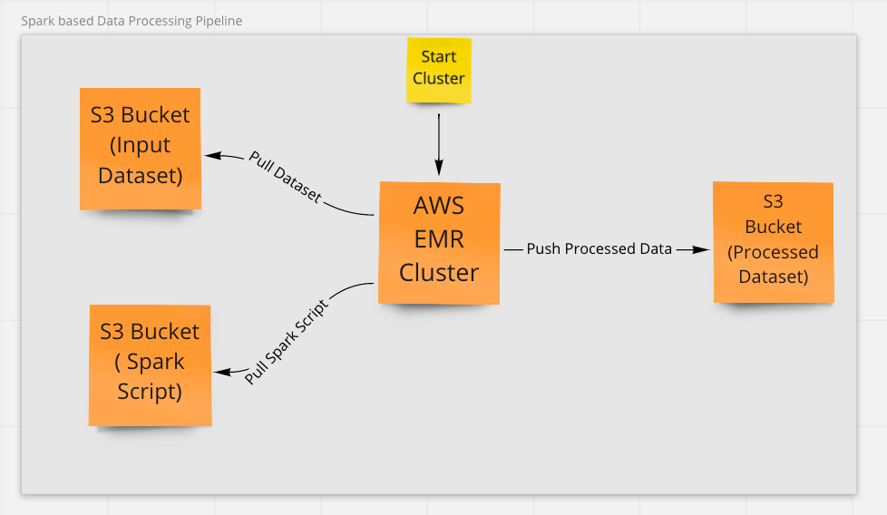

# Spark_Data_poecessing_pipeline
  The pipeline processes the data in the AWS EMR cluster with Spark.
  
Amazon EMR is the cloud based big data platform for processing vast amounts of data using open source tools such as Apache Spark, Apache Hive, Apache HBase, Apache Flink, Apache Hudi, and Presto. (Source aws.amazon.com)

 
 

In this pipeline, I created a Spark-based Transient AWS EMR cluster. The transient EMR cluster terminates automatically once it finishes the job. The cluster performs the job in 3 steps. The written instructions are available in the custom JAR script. Check the custom JAR script in the repository. The 3 steps are mentioned below. 

1. EMR cluster pulls the sparkProcessingScript.py script. All the processing actions are written down in this python script.
2. The cluster read the data from s3 bucket (users_app_big_dataset.csv) and perform all the processing task on it.
3. After processing, save the processed data in the S3 Bucket as parquet file.

If you want to play locally without EMR cluster, check sparkProcessingScript.ipynb notebook. You need spark installed in your machine.
